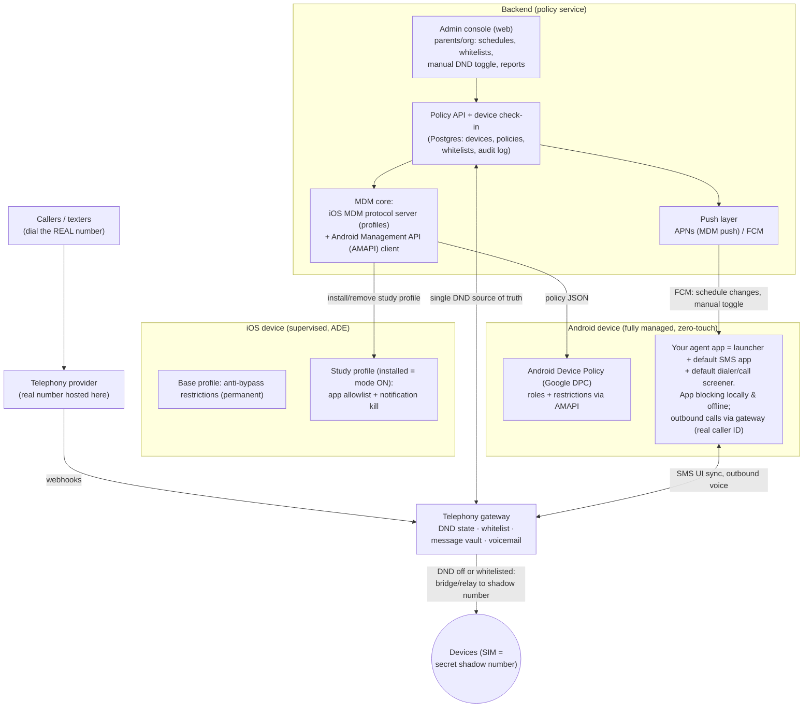

# Custom MDM "Study Lockdown" Platform — Architecture & Feasibility

**Goal:** a custom MDM platform for iOS and Android with an elevated Do-Not-Disturb
("Study Mode"). When active, the enrolled device blocks all apps, texts, and calls so
the student studies without distraction. Only emergency and whitelisted numbers ring
through and notify. Texts are invisible to the student until the mode ends, then appear.

Research date: August 2026. Deep dives with sources:
- [iOS platform capabilities](./ios-platform-capabilities.md)
- [Android platform capabilities](./android-platform-capabilities.md)
- [**MVP — data-only line + softphone**](./mvp-data-only-softphone.md) — **the real MVP
  (Aug 2026): the anti-bypass design.** Data-only SIM, app as the only dialer/messenger.
- [Telephony gateway (number-in-the-cloud) design](./telephony-gateway.md) — the
  calls/texts routing mechanism (number hosted in the cloud); its threat model drove the
  data-only decision above
- [MVNO / carrier-partnership paths](./mvno-carrier-paths.md) — how an MVNE-hosted core
  makes the MVP easier and upgrades anti-bypass to a network guarantee (ODB); with a
  phased recommendation
- [Routing method comparison with flow diagrams](./routing-methods.md) — why porting
  beats forwarding / on-device / MVNO ([visual version](./routing-methods.html))
- Diagrams: [two numbers / where LTE comes from](./two-numbers-explainer.html) ·
  [the shadow-number leak & the data-only fix](./shadow-leak-and-fix.html)

---

## 1. The feasibility verdict (with the telephony gateway adopted)

The **telephony gateway** ([design](./telephony-gateway.md)) hosts the student's real
phone number in the cloud; the SIM carries a secret shadow number. All calls and texts
hit our server first, where DND policy is applied — identically on both platforms,
upstream of the device.

| Requirement | Android (fully managed) | iOS (supervised MDM) |
|---|---|---|
| Block all apps except whitelist | ✅ On-device: `setPackagesSuspended` + kiosk | ✅ On-device: `allowListedAppBundleIDs` |
| Whitelist-only incoming calls, emergency always through | ✅ **Gateway** (agent's `CallScreeningService` as defense-in-depth) | ✅ **Gateway** — closes the platform gap; no iOS API needed |
| Texts invisible until mode ends, then appear | ✅ **Gateway holds them server-side** (agent SMS app for UI/threading + defense-in-depth) | ✅ **Gateway holds them server-side** — true holding, stronger than notification suppression |
| Student cannot bypass | ✅ Android 15+/locked bootloader + zero-touch; DND itself is server-side, unbypassable from the device | ✅ ADE + supervision + non-removable enrollment; DND server-side |

**Bottom line:** with calls/texts moved upstream to the gateway, both platforms deliver
the full vision. On-device platform work narrows to app blocking + anti-bypass (both
solid), plus the Android agent providing native dialer/SMS UX. The prior platform-API
limits (iOS call blocking, iOS message delay, Android RCS bypass) are largely mooted
because policy is applied before anything reaches the device — the residual risks are
gateway-specific (shadow-number leakage, reply threading on iOS; see the
[threat model](./telephony-gateway.md#threat-model--gotchas)).

---

## 2. System architecture



### Components

0. **Telephony gateway** — the backbone for calls/texts on both platforms. The real
   number is ported to the provider; DND policy is applied server-side (bridge / hold /
   voicemail / digest release). Full design, emergency-safety analysis, threat model,
   and per-device cost: [telephony-gateway.md](./telephony-gateway.md).
1. **Admin console (web)** — parents/org admins manage devices, whitelisted numbers,
   allowed apps, study schedules, manual on/off, and see reports (blocked-call counts,
   held-message counts, tamper events). Stack suggestion: Next.js + Supabase (auth,
   Postgres, realtime) on Vercel.
2. **Policy service** — source of truth for per-device policy. Serves device check-ins,
   pushes changes, records the audit log.
3. **iOS MDM core** — implements Apple's MDM protocol (or white-labels an existing
   server, e.g. NanoMDM/MicroMDM as a base): APNs MDM push certificate, ADE sync with
   Apple Business Manager, profile install/remove commands.
4. **Android side** — a GCP project driving the **Android Management API**; Google's
   own DPC holds Device Owner. Your **agent app** is granted the launcher, default-SMS,
   and call-screening roles by policy and enforces Study Mode locally.
5. **On-device enforcement first, push second (both platforms):** schedules are cached
   on the device and enforced locally so airplane mode/no signal can't dodge a session;
   server push is only for schedule *changes* and manual overrides.

### Policy model (sketch)

```json
{
  "deviceId": "…",
  "studyMode": {
    "active": true,
    "schedule": [{ "days": ["Mon","Tue","Wed","Thu","Fri"], "start": "16:00", "end": "19:00" }],
    "allowedApps": ["dialer", "agent", "study-app-ids…"],
    "whitelistNumbers": ["+1555…"],
    "emergencyAlwaysAllowed": true,
    "holdMessages": true,
    "otpPassthrough": true
  }
}
```

### Non-negotiable safety rules

- Outgoing emergency calls (911/112) are **never** blocked — both platforms guarantee
  this at the OS level; never attempt to defeat it.
- Inbound **emergency callbacks** (PSAP calling back after a 911 dial) bypass screening
  by platform design — market this as a safety feature.
- Whitelisted callers ring through with normal ring + notification.
- Mode end-time must release holds even fully offline (local schedule authority).
- Fail-secure: loss of connectivity keeps the device *locked*, never unlocked
  (iOS: study profile is removed to unlock; Android: agent enforces locally).

---

## 3. Android design (the flagship)

**Enrollment:** fully managed (Device Owner) via **zero-touch** (survives factory
reset, can't be skipped) or QR code at setup. Custom DPC registration is closed —
build on **AMAPI**; file a Play Protect DPC-allowlist appeal in parallel but don't
depend on it.

**Study Mode ON (all enforced locally by the agent, instantly, offline):**
1. `setPackagesSuspended` on everything outside the allowlist — icons grey out; tapping
   shows a branded dialog ("Study mode until 4:30 PM"); notifications suppressed at
   delivery. Optional hard tier: lock task (kiosk) mode with launcher + dialer only.
2. **Calls (primary enforcement = gateway, upstream):** non-whitelisted calls to the
   real number never reach the device during DND. The agent still holds
   `ROLE_CALL_SCREENING` (forced by AMAPI `defaultApplicationSettings`) as
   **defense-in-depth** for anything reaching the shadow number directly:
   `setDisallowCall + setRejectCall + setSkipCallLog + setSkipNotification` → fully
   invisible. 5-second response budget → whitelist is a local table. The agent-as-dialer
   also routes **outbound** calls through the gateway so caller ID shows the real
   number (prevents shadow-number leakage).
3. **Texts (primary enforcement = gateway):** held server-side during DND, digest on
   release. The agent remains the **default SMS app** for the UI — it renders
   gateway-delivered messages with the true sender (correct threading), sends replies
   back through the gateway, and silently vaults any SMS that hits the shadow number
   directly via `SMS_DELIVER`. **OTP carve-out** lives in the gateway.
4. **RCS:** mostly mooted — a VoIP-hosted real number can't register RCS, so senders
   fall back to SMS into the gateway. Still block Google Messages
   (`installType: BLOCKED`) and disable RCS on the SKU so the *shadow* number can't
   become an RCS endpoint either.

**Anti-bypass baseline (always on):** `DISALLOW_FACTORY_RESET`, `DISALLOW_SAFE_BOOT`,
`DISALLOW_DEBUGGING_FEATURES`, `DISALLOW_CONFIG_DATE_TIME` + auto-time,
`DISALLOW_ADD_USER`/`USER_SWITCH`, `DISALLOW_APPS_CONTROL`,
`setUserControlDisabledPackages(agent)`, `setPermittedInputMethods`,
`DISALLOW_INSTALL_UNKNOWN_SOURCES_GLOBALLY`, enterprise FRP, persistent HOME activity.

**Hardware strategy:** standardize on a fixed SKU, **Android 15+ (ideally 16+) with a
locked bootloader**. Reasons: (a) AMAPI `DEFAULT_SMS` appears to require Android 16+ —
verify first, it dictates the fleet; (b) on ≤14, OEM-unlock + recovery reset is a
5-minute YouTube bypass; on 15+ enterprise FRP is always enforced; (c) shipping the
device lets you pre-disable RCS. This is exactly why Gabb/Bark/Pinwheel sell hardware.

---

## 4. iOS design (strong tier, honest limits)

**Enrollment:** Apple Business Manager + **Automated Device Enrollment** → supervised,
`is_mdm_removable: false`. Even a DFU wipe returns to the Remote Management screen.
Requires a business entity (D-U-N-S) and ABM-channel device purchase. Devices: iPhone
12/A14 or later (older SoCs are permanently jailbreakable via checkm8).

**Study Mode ON = install the study profile:**
- `allowListedAppBundleIDs = [Phone, agent app, com.apple.webapp, approved study apps]`
  — everything else (Messages, Safari, social, games) disappears and cannot launch;
  data preserved; all restored when the profile is removed.
- `com.apple.notificationsettings`: `NotificationsEnabled=false` for Messages and any
  allowed-but-muted apps; `allowNotificationsModification=false` so it can't be re-enabled.
- Result: no banners, sounds, or badges; Messages inaccessible; when the mode ends the
  full text backlog appears at once. (Delivery itself is not delayed — senders see
  "Delivered" — but the student experiences exactly the intended behavior.)

**Study Mode OFF = remove the study profile.** The base profile (anti-bypass
restrictions: no app removal, no erase, no profile installs, forced auto-time,
Activation Lock) stays permanently. This remove-to-unlock design is fail-secure:
going offline keeps the device locked.

**Calls and texts — solved by the gateway.** No iOS API blocks calls by whitelist or
delays message delivery (CallKit is blocklist-only and static; no MDM key exists;
Focus modes have no API/MDM control) — but with the real number hosted at the
[telephony gateway](./telephony-gateway.md), whitelist-only calling and true text
holding happen upstream of the device, so no iOS API is needed. The study profile's
notification-kill + app-hiding remains as defense-in-depth for anything that reaches
the shadow number directly. Residual iOS-specific items: outbound native calls expose
the shadow number as caller ID (mitigate with rotation + monitoring), and held-text
delivery uses either proxy-number threading or our app's inbox.
Fallback options if the gateway were ever abandoned: Apple's Communication Limits via
Family Sharing (manual, no API; verify coexistence with MDM supervision) or an
MVNO partnership.

**Hard constraints to design around (verified):** MDM supervision and Screen Time
API `.child` authorization are **mutually exclusive**; `.individual` Screen Time
authorization is deletable by the user; no API can read/hide/delay SMS or iMessage;
push latency is seconds-to-minutes → schedule crispness needs the profile-swap
timed server-side with margin, or DDM when Apple ships schedule predicates.

---

## 5. Build roadmap

Re-ranked (Aug 2026) around the adopted **telephony gateway**: the gateway is now the
first thing built — it delivers the calls/texts core of the product on both platforms
at once, and it de-risks the project *before* the slow MDM paperwork (ABM, zero-touch,
Play declarations) completes.

**Phase 0 — de-risk (1–2 weeks of spikes, before any product code)**
1. **Gateway spike (highest priority):** buy a test number on Twilio, build the webhook
   policy loop (DND flag → bridge / hold / voicemail / digest release). Verify with a
   real SIM as the shadow number: bridged call quality/latency, SMS relay, MMS.
2. **Number-hosting checks:** port a sacrificial real number; confirm a VoIP-hosted
   number cannot register RCS or iMessage (and deregister iMessage at port time);
   confirm P2P relay classification with the provider (10DLC/A2P).
3. **Emergency-path test:** outgoing 911-equivalent (provider test harness) uses the
   SIM; PSAP-callback simulation rings the shadow number directly.
4. Verify AMAPI `DEFAULT_SMS` minimum Android version (16+?) — still matters for the
   agent's SMS-app role (UI/threading + defense-in-depth), and dictates hardware.
5. Prototype on Android: whitelisted bridged call ringing through lock task mode +
   suspended apps; agent-as-SMS-app store injection for digest delivery.
6. iOS on real hardware: ADE profile swap latency for app blocking.
7. Start the long-lead-time paperwork now: ABM (D-U-N-S), APNs MDM cert, zero-touch
   reseller relationship, Google Play SMS-permission declaration / managed-Play private
   app question, (parallel) Play Protect DPC allowlist appeal.

**Phase 1 — Telephony gateway MVP (both platforms at once)**
Gateway policy service (DND state, whitelist, schedules as the single source of truth)
→ message vault + digest release + OTP passthrough → voicemail + held-call review →
admin console v1 (devices, whitelist, schedule, manual DND toggle) → fail-open
provider fallback (gateway outage ⇒ normal phone, never stuck-in-DND). **At the end of
Phase 1 the core DND promise works on any phone, even before MDM enrollment ships.**

**Phase 2 — Android device tier (app blocking + native UX)**
AMAPI fully-managed enrollment (zero-touch/QR) → agent app: launcher + local schedule
engine + `setPackagesSuspended` study mode → agent as default SMS app/dialer synced to
the gateway (true-sender threading, outbound calls presenting the real number) →
anti-bypass hardening pass against the bypass table → fixed hardware SKU decision
(Android 15+/16+, locked bootloader, RCS off).

**Phase 3 — iOS device tier (app blocking)**
MDM server (build on NanoMDM or license) → ADE flow → base + study profiles
(app allowlist + notification kill as defense-in-depth) → profile-swap scheduler with
latency margin → shadow-number rotation tooling (iOS outbound caller-ID leak mitigation).

**Phase 4 — scale**
Proxy-number-per-contact threading for iOS, group-text handling, fleet dashboard,
tamper alerting, multi-child/org accounts, MVNO evaluation (only if gateway economics
or shadow-number leakage demand it).

**Compliance notes:** this is only lawful/ethical for devices you own or manage with
authority (your children as their guardian, or org-owned devices with disclosed
policies). COPPA applies to child data; held messages should be stored encrypted
on-device with the server seeing only counts/metadata. Never weaken the emergency-call
paths.
