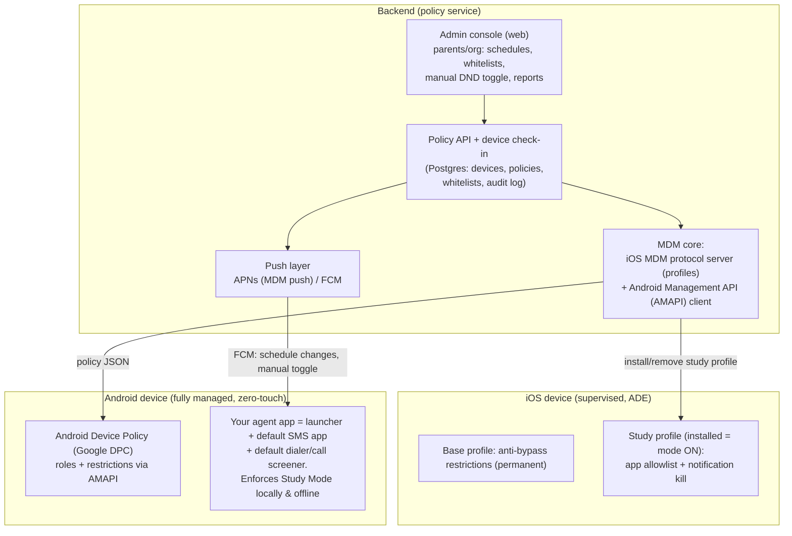

# Custom MDM "Study Lockdown" Platform — Architecture & Feasibility

**Goal:** a custom MDM platform for iOS and Android with an elevated Do-Not-Disturb
("Study Mode"). When active, the enrolled device blocks all apps, texts, and calls so
the student studies without distraction. Only emergency and whitelisted numbers ring
through and notify. Texts are invisible to the student until the mode ends, then appear.

Research date: August 2026. Deep dives with sources:
- [iOS platform capabilities](./ios-platform-capabilities.md)
- [Android platform capabilities](./android-platform-capabilities.md)

---

## 1. The honest feasibility verdict

| Requirement | Android (fully managed) | iOS (supervised MDM) |
|---|---|---|
| Block all apps except whitelist | ✅ Solid (`setPackagesSuspended` + kiosk) | ✅ Solid (`allowListedAppBundleIDs`) |
| Whitelist-only incoming calls, emergency always through | ✅ Solid (`CallScreeningService`) | ❌ **No API.** Only Apple's own Screen Time Communication Limits (no API/MDM access) or carrier/MVNO-level blocking |
| Texts invisible until mode ends, then appear | ✅ For SMS/MMS (custom default SMS app). ⚠️ RCS must be disabled + Google Messages blocked | ⚠️ Suppress-only: no banner/sound/badge and Messages app hidden — but delivery can't be delayed; backlog appears when mode ends. No hold of iMessage/SMS is possible, period |
| Student cannot bypass | ✅ Solid on Android 15+/locked bootloader + zero-touch | ✅ Solid with ADE + supervision + non-removable enrollment |

**Bottom line:** Android delivers 100% of the vision. iOS delivers the *experienced*
behavior for apps and texts (the student sees nothing until the mode ends) but cannot
block calls programmatically and cannot truly delay message delivery — Apple exposes no
API for either, and every competitor that ships whitelist-only calling (Gabb, Troomi,
Pinwheel, Bark Phone) did it by **going Android + carrier-level control**. Plan the
flagship experience on Android; ship iOS as a strong-but-honest tier, and close the
iOS call gap either with Apple's Family-Sharing Communication Limits (manual, outside
your control) or an MVNO partnership (network-level allowlist — the only real fix).

---

## 2. System architecture



### Components

1. **Admin console (web)** — parents/org admins manage devices, whitelisted numbers,
   allowed apps, study schedules, manual on/off, and see reports (blocked-call counts,
   held-message counts, tamper events). Stack suggestion: Next.js + Supabase (auth,
   Postgres, realtime) on Vercel.
2. **Policy service** — source of truth for per-device policy. Serves device check-ins,
   pushes changes, records the audit log.
3. **iOS MDM core** — implements Apple's MDM protocol (or white-labels an existing
   server, e.g. NanoMDM/MicroMDM as a base): APNs MDM push certificate, ADE sync with
   Apple Business Manager, profile install/remove commands.
4. **Android side** — a GCP project driving the **Android Management API**; Google's
   own DPC holds Device Owner. Your **agent app** is granted the launcher, default-SMS,
   and call-screening roles by policy and enforces Study Mode locally.
5. **On-device enforcement first, push second (both platforms):** schedules are cached
   on the device and enforced locally so airplane mode/no signal can't dodge a session;
   server push is only for schedule *changes* and manual overrides.

### Policy model (sketch)

```json
{
  "deviceId": "…",
  "studyMode": {
    "active": true,
    "schedule": [{ "days": ["Mon","Tue","Wed","Thu","Fri"], "start": "16:00", "end": "19:00" }],
    "allowedApps": ["dialer", "agent", "study-app-ids…"],
    "whitelistNumbers": ["+1555…"],
    "emergencyAlwaysAllowed": true,
    "holdMessages": true,
    "otpPassthrough": true
  }
}
```

### Non-negotiable safety rules

- Outgoing emergency calls (911/112) are **never** blocked — both platforms guarantee
  this at the OS level; never attempt to defeat it.
- Inbound **emergency callbacks** (PSAP calling back after a 911 dial) bypass screening
  by platform design — market this as a safety feature.
- Whitelisted callers ring through with normal ring + notification.
- Mode end-time must release holds even fully offline (local schedule authority).
- Fail-secure: loss of connectivity keeps the device *locked*, never unlocked
  (iOS: study profile is removed to unlock; Android: agent enforces locally).

---

## 3. Android design (the flagship)

**Enrollment:** fully managed (Device Owner) via **zero-touch** (survives factory
reset, can't be skipped) or QR code at setup. Custom DPC registration is closed —
build on **AMAPI**; file a Play Protect DPC-allowlist appeal in parallel but don't
depend on it.

**Study Mode ON (all enforced locally by the agent, instantly, offline):**
1. `setPackagesSuspended` on everything outside the allowlist — icons grey out; tapping
   shows a branded dialog ("Study mode until 4:30 PM"); notifications suppressed at
   delivery. Optional hard tier: lock task (kiosk) mode with launcher + dialer only.
2. **Calls:** agent holds `ROLE_CALL_SCREENING` (forced by AMAPI
   `defaultApplicationSettings`, user cannot change it). Non-whitelisted:
   `setDisallowCall + setRejectCall + setSkipCallLog + setSkipNotification` → fully
   invisible (or `setSilenceCall` for a reviewable "held calls" list). Whitelisted:
   pass through untouched. 5-second response budget → whitelist is a local table.
3. **Texts:** agent is the **default SMS app** — it receives every SMS via
   `SMS_DELIVER`, stores it encrypted, posts **no notification** during the mode, then
   shows the digest ("4 messages while you were studying") when the mode ends.
   Whitelisted senders' texts notify normally even during the mode.
   **OTP carve-out:** parse held texts for verification codes and pass them through.
4. **RCS:** Google Messages is `installType: BLOCKED` and RCS disabled on the SKU —
   otherwise RCS silently bypasses the hold (only Google Messages can use Android's
   RCS API). Senders fall back to SMS.

**Anti-bypass baseline (always on):** `DISALLOW_FACTORY_RESET`, `DISALLOW_SAFE_BOOT`,
`DISALLOW_DEBUGGING_FEATURES`, `DISALLOW_CONFIG_DATE_TIME` + auto-time,
`DISALLOW_ADD_USER`/`USER_SWITCH`, `DISALLOW_APPS_CONTROL`,
`setUserControlDisabledPackages(agent)`, `setPermittedInputMethods`,
`DISALLOW_INSTALL_UNKNOWN_SOURCES_GLOBALLY`, enterprise FRP, persistent HOME activity.

**Hardware strategy:** standardize on a fixed SKU, **Android 15+ (ideally 16+) with a
locked bootloader**. Reasons: (a) AMAPI `DEFAULT_SMS` appears to require Android 16+ —
verify first, it dictates the fleet; (b) on ≤14, OEM-unlock + recovery reset is a
5-minute YouTube bypass; on 15+ enterprise FRP is always enforced; (c) shipping the
device lets you pre-disable RCS. This is exactly why Gabb/Bark/Pinwheel sell hardware.

---

## 4. iOS design (strong tier, honest limits)

**Enrollment:** Apple Business Manager + **Automated Device Enrollment** → supervised,
`is_mdm_removable: false`. Even a DFU wipe returns to the Remote Management screen.
Requires a business entity (D-U-N-S) and ABM-channel device purchase. Devices: iPhone
12/A14 or later (older SoCs are permanently jailbreakable via checkm8).

**Study Mode ON = install the study profile:**
- `allowListedAppBundleIDs = [Phone, agent app, com.apple.webapp, approved study apps]`
  — everything else (Messages, Safari, social, games) disappears and cannot launch;
  data preserved; all restored when the profile is removed.
- `com.apple.notificationsettings`: `NotificationsEnabled=false` for Messages and any
  allowed-but-muted apps; `allowNotificationsModification=false` so it can't be re-enabled.
- Result: no banners, sounds, or badges; Messages inaccessible; when the mode ends the
  full text backlog appears at once. (Delivery itself is not delayed — senders see
  "Delivered" — but the student experiences exactly the intended behavior.)

**Study Mode OFF = remove the study profile.** The base profile (anti-bypass
restrictions: no app removal, no erase, no profile installs, forced auto-time,
Activation Lock) stays permanently. This remove-to-unlock design is fail-secure:
going offline keeps the device locked.

**Calls — the gap:** no iOS API blocks calls by whitelist (CallKit is blocklist-only
and static; no MDM key exists; Focus modes have no API/MDM control). Options:
1. **Communication Limits via Family Sharing** (Apple's built-in Screen Time feature
   does exactly whitelist-only calls/texts during downtime) — but it has no API, must
   be configured manually by the parent, and needs iCloud Family + iCloud contacts.
   Verify on hardware that it coexists with MDM supervision.
2. **MVNO/carrier partnership** — network-level inbound allowlist. The only
   un-bypassable fix; how the kid-phone companies do it. Bonus: works identically for
   Android and removes the RCS concern for held-text *senders*.
3. Accept ring-through on iOS tier and set expectations.

**Hard constraints to design around (verified):** MDM supervision and Screen Time
API `.child` authorization are **mutually exclusive**; `.individual` Screen Time
authorization is deletable by the user; no API can read/hide/delay SMS or iMessage;
push latency is seconds-to-minutes → schedule crispness needs the profile-swap
timed server-side with margin, or DDM when Apple ships schedule predicates.

---

## 5. Build roadmap

**Phase 0 — de-risk (1–2 weeks of spikes, before any product code)**
1. Verify AMAPI `DEFAULT_SMS` minimum Android version (16+?). Dictates hardware.
2. Prototype: whitelisted call ringing through while in lock task mode + suspended apps.
3. Prototype: custom default SMS app holding + digest release; test RCS-off fallback,
   MMS download, OTP passthrough, `RECEIVE_SMS` leakage.
4. iOS on real hardware: ADE profile swap latency; Communication Limits + MDM coexistence.
5. Start the long-lead-time paperwork now: ABM (D-U-N-S), APNs MDM cert, zero-touch
   reseller relationship, Google Play SMS-permission declaration / managed-Play private
   app question, (parallel) Play Protect DPC allowlist appeal.

**Phase 1 — Android MVP (the full vision)**
Agent app (launcher + SMS + screening) with local schedule engine → AMAPI policy
scaffolding → admin console (devices, whitelist, schedule, manual toggle) → digest UX
+ held-calls review → anti-bypass hardening pass against the bypass table.

**Phase 2 — iOS tier**
MDM server (build on NanoMDM or license) → ADE flow → base + study profiles →
profile-swap scheduler with latency margin → parent-guided Communication Limits setup
flow (or MVNO integration if pursued).

**Phase 3 — scale**
MVNO evaluation, fleet dashboard, tamper alerting, multi-child/org accounts.

**Compliance notes:** this is only lawful/ethical for devices you own or manage with
authority (your children as their guardian, or org-owned devices with disclosed
policies). COPPA applies to child data; held messages should be stored encrypted
on-device with the server seeing only counts/metadata. Never weaken the emergency-call
paths.
