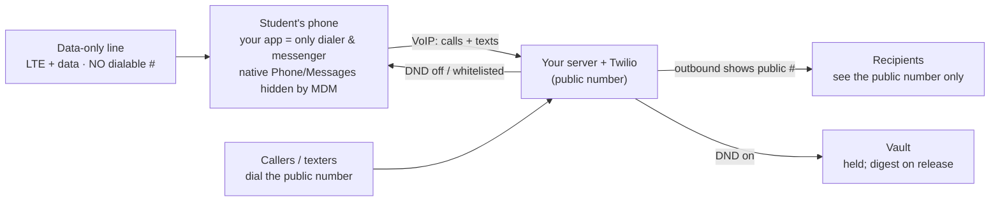

# The MVP — Data-Only Line + Softphone ("Option 3")

**Status: adopted Aug 2026 as the real MVP.** This is the anti-bypass answer. It
supersedes the voice-capable-shadow-line design for the shipping product; a
voice-capable shadow line remains acceptable only for early routing tests.

Visual explainers: [two-numbers-explainer.html](./two-numbers-explainer.html) (why the
phone keeps full LTE without us being a carrier) and
[shadow-leak-and-fix.html](./shadow-leak-and-fix.html) (the bypass this design closes).

---

## The problem this solves

The number-in-the-cloud port design ([telephony-gateway.md](./telephony-gateway.md))
controls calls and texts on both platforms — but it leaves the phone holding a
**voice-capable shadow line with a dialable number**. That number is a bypass:

- Outbound native calls/texts show the shadow number as caller ID → a contact saves it
  → calls it directly → rings the phone with no server in the path, no DND.
- Anyone told the shadow number can reach the phone directly.

On **Android** the device-owner agent contains this (routes outbound as the public
number, screens direct-to-shadow calls). On **iPhone** there is **no on-device fix** —
Apple lets no app reroute outbound calls or screen inbound ones. So a voice-capable
shadow line makes the product bypassable on iPhone, which defeats the entire purpose.

## The design

**Remove the dialable shadow number entirely.** The SIM carries a **data-only line**;
**your app is the only dialer and messenger**, always operating over the public number.

- **Data/coverage:** a real carrier data-only line (full LTE). We are still **not** a
  carrier; a real carrier provides the data. Twilio is never in the data path.
- **All voice + SMS:** in-app VoIP over the public number. There is no cellular voice
  number on the SIM to leak or to dial.
- **Outbound caller ID:** always the public number (the app routes through the server).
- **Inbound:** always hits the server first (the public number lives there). Nothing
  reaches the phone except through the app.
- **DND:** a server-side flag — instant, identical on both platforms, unbypassable from
  the device because there is no alternate path off the phone.
- **App blocking (unchanged):** on-device MDM — supervised iOS profile / Android
  device-owner — hides native Phone/Messages and every non-approved app.

### Why the leak is closed on both platforms

There is no voice number on the SIM, so:
1. Outbound can *only* go through the app → always the public number as caller ID.
2. There is no shadow number for anyone to be given or to dial around.

This is the same conclusion every serious anti-bypass product reaches (Gabb, Pinwheel,
Bark all control the whole telephony surface). Option 3 is that move, minus owning a
network — for now (see the MVNO paths, forthcoming doc).

## What has to be built (the softphone)

The device-side app becomes a **softphone**, not just an agent:

| Piece | iOS | Android |
|---|---|---|
| In-app **voice** calling (VoIP) | CallKit-integrated VoIP (Twilio Voice SDK or similar) so calls look native | ConnectionService self-managed VoIP; agent is also default dialer |
| In-app **messaging** over the public number | Custom inbox (SMS/MMS relayed via server) | Agent as default SMS app *and* app inbox for relayed messages |
| **Incoming call** wake | PushKit VoIP push → CallKit incoming UI | FCM high-priority → ConnectionService |
| Native Phone/Messages hidden | Supervised MDM app allowlist (omit `com.apple.mobilephone`, `com.apple.MobileSMS`) | Device-owner: block/hide packages |
| **Emergency calling** | see below — first-class requirement | see below |
| DND enforcement | server-side flag; app shows study-mode state | server-side flag + local schedule cache |

### Emergency calling (911) — a first-class requirement, not an afterthought

A data-only line may **not** support native cellular 911. This is safety-critical and
must be designed and verified before launch, with telecom/regulatory guidance:

- **E911-registered VoIP** for outbound emergency: the softphone routes 911 to an
  E911-enabled provider with a registered/dynamic address so the PSAP gets callback +
  location. Verify provider support and reliability.
- **Native fallback:** confirm whether the device can still reach emergency services
  over any available network regardless of the data-only plan (device/carrier/region
  dependent — test on real hardware, do not assume).
- **Callback:** ensure a PSAP callback reaches the student (via the softphone / server),
  since there is no dialable cellular number.
- **Never gate 911 behind DND, the whitelist, or login.** Always available.

## Honest tradeoffs

- **Bigger build:** you're shipping a softphone (VoIP calling + messaging inbox), not a
  thin agent. This is the main added scope vs. the bridge-to-shadow design.
- **Call quality rides on data:** VoIP depends on the data connection; poor coverage
  degrades calls where a cellular voice line would hold. Mitigate with good codecs,
  network handling, and adequate data coverage on the chosen line.
- **Native telephony goes away:** no native Phone/Messages — which *aligns* with the
  MDM app-hiding, but changes UX (and iMessage/RCS are out of the picture, which for
  this product is a feature, not a loss).
- **Still multi-vendor (for now):** public number at Twilio + a data-only SIM/eSIM from
  a carrier + your server. Collapsing this stack — and upgrading anti-bypass from
  device-side to network-level — is what an MVNE-hosted core does; see
  [mvno-carrier-paths.md](./mvno-carrier-paths.md).

## Phasing

1. **MVP-test (voice-capable shadow ok):** prove the routing loop end to end with the
   current `focus-gateway` + a voice-capable shadow SIM. Android's agent already
   contains the leak; good enough to validate DND, whitelist, hold, digest.
2. **MVP-ship (data-only + softphone):** data-only line, in-app VoIP calling/messaging,
   native telephony hidden by MDM, E911 solved. This is the bypass-resistant product.
3. **Stack collapse:** move number provisioning + data line under one MVNE/MVNO or
   carrier partnership (see [mvno-carrier-paths.md](./mvno-carrier-paths.md)). This does
   more than remove vendors: a hosted core lets you ship a **voice+SMS-barred,
   data-enabled, emergency-exempt** SIM via **Operator Determined Barring (ODB)** —
   turning anti-bypass into a *network* guarantee (no dialable voice number can exist)
   and adding a free always-on **native 911 fallback** on top of the softphone's E911.
   That is categorically stronger than MDM-hides-the-app, and is the recommended
   graduation from the CPaaS-port MVP.

## Open items to close before ship

- E911 solution selected, registered, and tested on real hardware (both platforms).
- Data-only line source chosen with adequate voice-over-data coverage.
- Softphone call quality validated on weak networks.
- Provisioning flow: data-only SIM/eSIM activation + public-number hosting in one
  onboarding pass (ideally collapsed via an MVNE — pending research).
