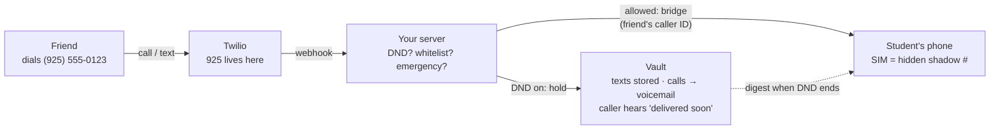
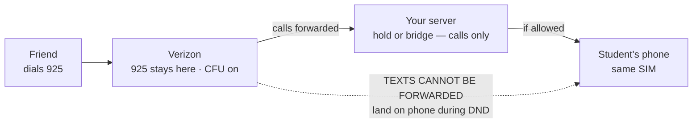
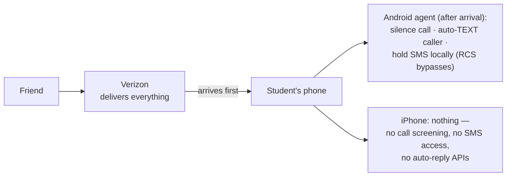
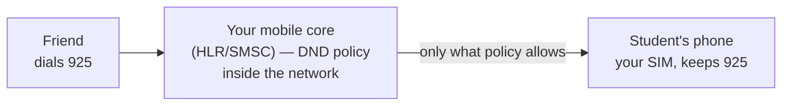

# Call & Text Routing — Method Comparison

How Do-Not-Disturb can (and cannot) be put between a caller and the student's
existing number — e.g. `(925) 555-0123`. Full research: the two agent reports
summarized in [telephony-gateway.md](./telephony-gateway.md) and the platform deep
dives. A styled visual version of this page lives at
[routing-methods.html](./routing-methods.html) (rendered at
`rameenhash.github.io/docs/mdm-focus-platform/routing-methods.html` once merged).

**The core fact:** the carrier decides where a call or text goes *before* any app on
the phone runs. Only two mechanisms exist to change that decision — **porting the
number** or **call forwarding**. No carrier API (CAMARA / Open Gateway / Twilio /
Telesign, 2025–2026) can redirect inbound traffic on an un-ported line; they are
detect-only.

## Method 1 — Port the number to your provider ✅ CHOSEN

- Caller keeps dialing 925 forever; the shadow number is invisible plumbing.
- Calls **and** texts held; caller hears the message; identical on iPhone and Android.
- DND toggle is a server-side flag — instant, unbypassable from the device.
- Outgoing 911 uses the real SIM; PSAP callback rings the shadow number directly.
- One-time friction per student: port (LOA + carrier PIN, 5–15 business days) plus a
  replacement line on the family's existing carrier plan (family keeps their
  Verizon/AT&T/T-Mobile plan and bill; the ported-out line is replaced by the new
  shadow-number line, same line count, ~same cost).

## Method 2 — Carrier call forwarding (`**21*…#`) ❌ REJECTED

- **SMS has no forwarding mechanism at any carrier** — the texts half is impossible.
- Toggle is manual dial codes: no API on iPhone at all, unreliable on Android — the
  opposite of enforced DND.
- Whitelist ring-through needs a hidden second number anyway (bridging back to 925
  would loop).

## Method 3 — App on the phone only ❌ REJECTED

- Everything reaches the phone first; the app can only react after the fact.
- The "caller hears your message" experience is an answering-machine (IVR) function —
  it requires a server that *answers* the call. No phone OS lets an app inject audio
  into a live carrier call.
- iPhone offers zero capability here — this wall is what forces a server into the path.

## Method 4 — Become the carrier (MVNO) ⏸ DEFERRED

- Same control as porting (you *are* the number's home), used by Gabb/Pinwheel/Bark.
- Months of build + carrier wholesale agreements; students still move onto your SIM —
  so per-user friction isn't lower, the build is just vastly bigger.
- Natural Phase 4+ evolution if port-onboarding friction limits growth.

## Side by side

| Method | Caller keeps 925 | Caller hears "delivered soon" | Calls held | Texts held | iPhone | DND toggle |
|---|---|---|---|---|---|---|
| **1 · Port (chosen)** | ✅ | ✅ | ✅ | ✅ | ✅ | ✅ instant, server-side |
| 2 · Forwarding | ✅ | ✅ calls | ✅ | ❌ can't forward SMS | ⚠️ calls only | ❌ manual dial codes |
| 3 · On-device app | ✅ | ❌ (Android: text-only reply) | ❌ | ⚠️ Android SMS only | ❌ | ⚠️ Android only |
| 4 · MVNO | ✅ | ✅ | ✅ | ✅ | ✅ | ✅ instant, network-side |

**Verdict:** only a server in the number's path delivers the full experience, and
porting is the only practical way to put it there.
[focus-gateway](https://github.com/RameenHash/focus-gateway) implements Method 1
today — the Twilio test number stands in for a ported 925; production onboarding is
"port the student's number + add a hidden replacement line."
