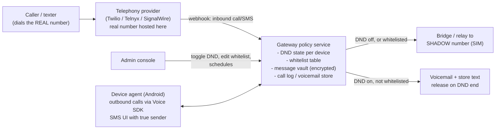

# Telephony Gateway — Number-in-the-Cloud Call & Text Control

**Decision (Aug 2026): adopted as the primary calls/texts mechanism for both
platforms** (Variant B below). Device-side MDM continues to handle app blocking;
the gateway handles all voice and messaging policy upstream of the device.

## Concept

The student's **real phone number is ported to our telephony provider** and lives at
the gateway permanently. The SIM in the phone carries a new **shadow number** that is
never shared. Every call and text to the real number therefore hits our server first —
DND on or off — and the server applies policy:

| State | Calls | Texts |
|---|---|---|
| DND **off** | Bridge instantly to the shadow number — normal experience | Relay to device |
| DND **on**, whitelisted/emergency-related caller | Bridge through — phone rings + notifies normally | Deliver + notify normally |
| DND **on**, everyone else | "Studying until 7:00 PM" voicemail; call logged for later review | **Stored server-side — true holding.** Delivered as a digest when DND ends |

This is the same pattern Google Voice uses, and functionally what kid-phone MVNOs
(Gabb/Troomi/Pinwheel) achieve at the network core — without becoming an MVNO.

## Why Variant B beats DND-toggled carrier forwarding (Variant A, rejected)

- Forwarding (`**21*…#`) loops when the server bridges a whitelisted call back to the
  same number — whitelist ring-through needs a second number anyway.
- iOS has no API to toggle call forwarding; it would be a manual, unenforceable step.
- Carrier forwarding does nothing for SMS.
- With Variant B nothing needs toggling on the device at all: DND is a server-side
  flag flip — instant, identical on both platforms, immune to airplane mode and
  every on-device bypass.

## Why this closes the iOS gap

iOS offers no API for whitelist call blocking or for delaying SMS/iMessage
(see [ios-platform-capabilities.md](./ios-platform-capabilities.md)). The gateway
enforces both **upstream of the device**, so iOS reaches near-parity with Android:

1. **Whitelist-only calls on iOS** — done at the server; no CallKit, no Screen Time,
   no Communication Limits dependency.
2. **True text holding on iOS** — the message never reaches the device until release
   (stronger than the notification-suppression fallback, which only hides it).
3. **RCS / iMessage largely neutralized** — VoIP-hosted numbers generally cannot
   register for RCS or iMessage, so senders' phones fall back to plain SMS to the
   real number, which lands at the gateway. Verify per provider during the spike;
   explicitly deregister the ported number from iMessage at porting time.

## Architecture

## What runs where: our server vs the provider

A phone number must be hosted by a licensed carrier — a server cannot connect to the
PSTN directly. So the provider's involvement is a regulatory necessity, but its role
can be reduced to a dumb pipe: **all policy, storage, and state live on our server**
(DND flags, whitelist, the message vault, voicemail recordings, call logs). The
provider holds the number and executes instructions.

Call flow: caller dials the real number → carrier routes to the provider (the number
lives there) → provider hits **our server** with a webhook and waits → our server
checks DND state + whitelist → replies with an instruction ("bridge to shadow number"
or "play greeting, record voicemail") → provider executes. Inbound SMS: webhook → our
DB → relay now or hold-and-release. The provider never keeps the vault.

Two integration levels:

| | **Level 1 — managed (webhook mode)** | **Level 2 — self-hosted (SIP trunk mode)** |
|---|---|---|
| Provider does | Hosts number, carries call **audio**, executes our instructions | Hosts number, delivers raw SIP only |
| Our server does | Every decision + all storage (pull recordings to our own storage immediately) | Everything including media: our PBX (Asterisk/FreeSWITCH) answers, plays greetings, records, bridges |
| Ops burden | Low — no media servers | Real telecom ops: media, codecs, NAT traversal — **and uptime is now our problem** |
| Ownership | ~95% — provider transits audio | Full "my server is the call center" |

**Decision: build Phase 1 in Level 1 (webhook mode)**, with the gateway code behind a
thin provider interface so a Level 2 SIP/FreeSWITCH backend can be swapped in later
without touching policy logic (Telnyx sells plain SIP trunking cheaply for that path).
Either level keeps the fail-open rule: if our server doesn't answer within a few
seconds, the provider falls through to the shadow number — an outage degrades to
"normal phone," never to "child unreachable."

Implementation: **Phase 1 scaffold lives in its own repository,
[RameenHash/focus-gateway](https://github.com/RameenHash/focus-gateway)**
(Node/Express, Twilio behind the provider interface, SQLite; see its README for
local setup, Twilio console config, and the end-to-end test walkthrough).

Implementation sketch:
- **Provider:** Twilio (fastest to build: Programmable Voice + Messaging, number
  porting, SIP domains) — Telnyx/SignalWire as cost-optimized alternatives.
- **Gateway service:** stateless webhook handlers + Postgres (devices, dnd_state,
  whitelist, held_messages, call_events). DND schedule lives here too, so toggles are
  authoritative and instant server-side; the device schedule cache remains only for
  app blocking.
- **Voicemail script:** configurable per family; logs caller + timestamp for the
  after-session review list. Optional: notify the parent console in real time.
- **Digest release:** on DND end, deliver held texts (Android: push into agent's SMS
  store with true sender; iOS: relay or in-app inbox — see threading below) and a
  summary notification ("3 calls, 5 texts while you were studying").

## Emergency safety (by construction — never weaken)

- **Outgoing 911/112 always uses the real SIM over the cellular network.** Emergency
  calls are NEVER routed through VoIP. Both platforms guarantee SIM emergency dialing
  at the OS level regardless of our software.
- **PSAP callback rings the device directly**: the PSAP calls back the number that
  dialed — the shadow (SIM) number — bypassing the gateway entirely. Correct outcome.
- Calls **to** the shadow number always ring through (only the PSAP and the gateway
  itself should ever know it).
- E911 address registration on the hosted real number is still required by
  regulation even though we never expect emergency traffic on it.

## Threat model & gotchas

| Issue | Impact | Mitigation |
|---|---|---|
| **Shadow-number leakage** (outbound SIM calls show it as caller ID; a friend saves it and bypasses DND forever) | Main threat | **Android: solved** — agent is the dialer; route outbound via Voice SDK/SIP presenting the real number. **iOS: residual risk** — cannot force outbound routing; mitigate with periodic shadow-number rotation, monitoring inbound-to-shadow from unknown numbers, and blocking Contacts sharing of it where possible |
| **SMS reply threading** (relayed texts arrive "from" the relay number) | UX | Android: non-issue — agent is the SMS app; shows true sender, routes replies back through gateway. iOS: proxy-number-per-contact (Google Voice pattern, ~$1/mo per active contact number) or deliver via our app's inbox |
| MMS | Media messages | Provider MMS APIs handle inbound; relay as MMS or in-app media |
| **OTP/2FA codes held during DND** | Lockouts, support tickets | Gateway parses held texts for OTP patterns → immediate passthrough (configurable) |
| Group texts | Threading complexity | Phase-2 problem; start with pass-through-or-hold whole-group |
| Port authority | Legal | Number owner (parent/account holder) signs the LOA for porting |
| A2P/10DLC + STIR/SHAKEN | Compliance for SMS relay & outbound caller ID | Standard provider registration; person-to-person relay traffic — confirm classification with provider early |
| iMessage residue on ported number | iPhone senders' texts vanish into iMessage | Deregister at selfsolve.apple.com/deregister-imessage during onboarding; verify VoIP number cannot re-register |
| Voice latency on bridged calls | Call quality | Provider bridging adds ~100–200ms; acceptable; choose region-local media |
| Gateway outage | Calls/texts to real number fail | Provider-level failover: forward-to-shadow-number fallback rule if webhooks time out (fails open to "normal phone", never to "stuck in DND") |

## Cost per device (order of magnitude)

- Hosted number: ~$1–2/mo (+ proxy numbers on iOS if used)
- Voice: ~$0.01–0.02/min bridged (two legs)
- SMS: <$0.01/segment relayed
- Typical teen usage lands around **$3–8/device/month** — price the subscription accordingly.

## What stays on-device

- **App blocking** — cannot be done upstream; remains MDM/agent enforced
  ([Android](./android-platform-capabilities.md), [iOS](./ios-platform-capabilities.md)).
- **Android agent keeps the dialer + default-SMS roles anyway**: outbound caller-ID
  correctness, native threading UI, held-call review list, and defense-in-depth if a
  text ever reaches the SIM directly (e.g. someone who has the shadow number).
- iOS notification-suppression + app-hiding profile remains as defense-in-depth
  during DND (e.g. hides any traffic that reaches the shadow number).
